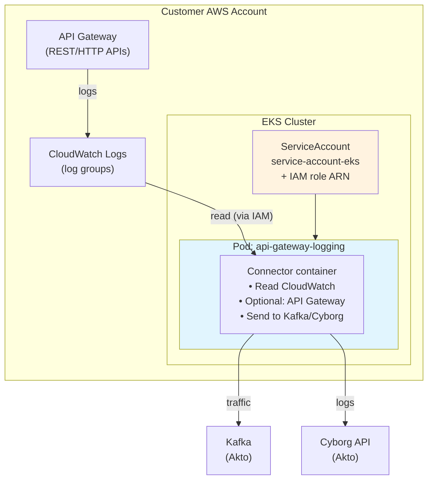

# API Gateway Connector – Helm Chart

This chart runs the **Akto API Gateway connector** on your EKS cluster. The connector reads API Gateway traffic from AWS CloudWatch Logs and sends it to Akto (via Kafka and Cyborg). Below is a minimal-Kubernetes overview and how the pieces fit together.

---

## Minimal Kubernetes concepts

| Term | What it means |
|------|----------------|
| **Cluster** | The Kubernetes “cluster” is the set of machines (nodes) and the control plane that run your workloads. On AWS this is EKS. |
| **Namespace** | A namespace is a folder inside the cluster. Resources (pods, deployments, etc.) live in a namespace (e.g. `akto`). |
| **Pod** | A pod is one or more containers running together on a node. Your app runs inside a container inside a pod. |
| **Deployment** | A Deployment is a recipe that says “run this many pods with this image and this config.” Kubernetes keeps that number of pods running (restarts them if they crash). |
| **ServiceAccount** | A ServiceAccount is an identity for pods. On EKS, we attach an AWS IAM role to it (IRSA) so the pod can call AWS APIs (CloudWatch, API Gateway) without storing access keys. |
| **Helm** | Helm is a tool that installs/upgrades “charts” (a set of YAML templates + default values) into the cluster. When you run `helm install`, it creates the resources defined in the chart. |

---

## What this chart contains

The chart has two templates that create two Kubernetes resources:

1. **ServiceAccount** (`templates/serviceaccount.yaml`)  
   - Name: `service-account-eks`  
   - You must set the annotation `eks.amazonaws.com/role-arn` to your IAM role ARN (IRSA).  
   - That role must have permissions for CloudWatch Logs and API Gateway (read).  
   - The Deployment’s pods use this ServiceAccount so the app can call AWS without keys.

2. **Deployment** (`templates/deployment.yaml`)  
   - Name: `api-gateway-logging`  
   - Runs **one pod** with **one container**: the connector image.  
   - The pod uses the ServiceAccount above.  
   - You must fill in the env vars (see below) so the app knows which log groups, region, Kafka, and token to use.

So: **one identity (ServiceAccount + IAM role) and one workload (Deployment → Pod → Container).**

---

## High-level flow (what the connector does)

```
┌─────────────────────────────────────────────────────────────────────────────────┐
│                         CUSTOMER'S AWS ACCOUNT                                    │
│                                                                                   │
│  ┌──────────────────┐         ┌─────────────────────────────────────────────┐   │
│  │ API Gateway      │         │ EKS CLUSTER                                  │   │
│  │ (REST/HTTP APIs) │         │                                              │   │
│  │                  │  logs   │  ┌─────────────────────────────────────┐    │   │
│  │  → requests      │ ──────► │  │ CloudWatch Logs                      │    │   │
│  │  → responses    │         │  │ (log groups you configure)            │    │   │
│  └────────┬────────┘         │  └──────────────────┬────────────────────┘    │   │
│           │                   │                     │                         │   │
│           │                   │                     │ read (IAM role)          │   │
│           │                   │                     ▼                         │   │
│           │                   │  ┌─────────────────────────────────────┐    │   │
│           │                   │  │ Pod (api-gateway-logging)            │    │   │
│           │                   │  │  ┌───────────────────────────────┐  │    │   │
│           │                   │  │  │ Container: connector app     │  │    │   │
│           │                   │  │  │ - reads CloudWatch log groups │  │    │   │
│           │                   │  │  │ - optional: API Gateway APIs │  │    │   │
│           │                   │  │  │ - sends to Kafka + Cyborg     │  │    │   │
│           │                   │  │  └───────────────┬───────────────┘  │    │   │
│           │                   │  │                  │                  │    │   │
│           │                   │  │  ServiceAccount: service-account-eks│   │   │
│           │                   │  │  (→ IAM role for AWS APIs)          │    │   │
│           │                   │  └──────────────────┬──────────────────┘    │   │
│           │                   │                     │                         │   │
│           │                   └─────────────────────┼─────────────────────────┘   │
│           │                                         │                             │
└───────────┼─────────────────────────────────────────┼─────────────────────────────┘
            │                                         │
            │                                         │ 1) traffic + metadata → Kafka
            │                                         │ 2) logs → Cyborg (HTTPS)
            │                                         ▼
            │                              ┌──────────────────────┐
            │                              │ Akto (Kafka + Cyborg) │
            │                              │ (your mini-runtime / │
            │                              │  SaaS endpoints)      │
            │                              └──────────────────────┘
```

- **API Gateway** sends access logs to **CloudWatch Logs** (log groups).  
- The **connector** runs in a **pod** on EKS, uses the **ServiceAccount** (and thus the IAM role) to **read** those log groups and optionally call **API Gateway** for OpenAPI discovery.  
- The connector **sends** data to **Kafka** (traffic) and **Cyborg** (logs) using the endpoints and token you configure via env vars.

So the Helm chart is only “run this one Deployment with this one ServiceAccount”; the architecture above is what that Deployment does in your and Akto’s infrastructure.

---

## Architecture diagram (Mermaid)

You can paste this into a Markdown viewer (e.g. GitHub, GitLab, or [Mermaid Live](https://mermaid.live)) to see the diagram.



---

## Steps to create the IAM role and attach it to the ServiceAccount

Do these steps once in your AWS account. Replace placeholders with your values.

### 1. Get your EKS OIDC provider ID

- In **AWS Console** → **EKS** → your cluster → **Overview** → **Details**.
- Copy the **OpenID Connect provider URL**, e.g. `https://oidc.eks.us-east-1.amazonaws.com/id/EXAMPLED539D4633E53DE1B716EXAMPLE`.
- The **OIDC provider ID** is the part after `/id/` (e.g. `EXAMPLED539D4633E53DE1B716EXAMPLE`). You need this for the trust policy.

You also need: **AWS Region** (e.g. `us-east-1`), **AWS Account ID** (e.g. `123456789012`), and the **namespace** where you will install the chart (e.g. `akto`).

---

### 2. Create an IAM policy (permissions for the connector)

1. Go to **IAM** → **Policies** → **Create policy**.
2. Open the **JSON** tab and paste the policy below.
3. Replace `REGION` and `ACCOUNT_ID` with your AWS region and account ID. For `Resource` under CloudWatch Logs you can use `arn:aws:logs:REGION:ACCOUNT_ID:log-group:*` to allow all log groups, or restrict to specific log group ARNs (e.g. `arn:aws:logs:REGION:ACCOUNT_ID:log-group:/aws/apigateway/my-api:*`).
4. Click **Next**, name the policy (e.g. `ApiGatewayConnectorPolicy`), then **Create policy**.

**Policy JSON:**

```json
{
  "Version": "2012-10-17",
  "Statement": [
    {
      "Effect": "Allow",
      "Action": [
        "logs:DescribeLogGroups",
        "logs:DescribeLogStreams",
        "logs:FilterLogEvents",
        "logs:GetLogEvents"
      ],
      "Resource": "arn:aws:logs:REGION:ACCOUNT_ID:log-group:*"
    },
    {
      "Effect": "Allow",
      "Action": [
        "apigateway:GET"
      ],
      "Resource": [
        "arn:aws:apigateway:REGION::/restapis",
        "arn:aws:apigateway:REGION::/restapis/*",
        "arn:aws:apigateway:REGION::/apis",
        "arn:aws:apigateway:REGION::/apis/*"
      ]
    }
  ]
}
```

---

### 3. Create the IAM role (trust policy for EKS)

1. Go to **IAM** → **Roles** → **Create role**.
2. **Trusted entity type:** Web identity.
3. **Identity provider:** Choose your EKS OIDC provider (e.g. `oidc.eks.REGION.amazonaws.com/id/OIDC_ID`).
4. **Audience:** `sts.amazonaws.com`.
5. Click **Next**.
6. Attach the policy you created in step 2 (e.g. `ApiGatewayConnectorPolicy`). Click **Next**.
7. Name the role (e.g. `api-gateway-connector-eks-role`). Click **Create role**.

Then update the **trust policy** so only your ServiceAccount can assume the role:

1. Open the role → **Trust relationships** → **Edit**.
2. Replace the policy with the one below. Replace:
   - `ACCOUNT_ID` – your AWS account ID
   - `REGION` – your EKS region (e.g. `us-east-1`)
   - `OIDC_ID` – the OIDC provider ID from step 1
   - `NAMESPACE` – the Kubernetes namespace where you will install the chart (e.g. `akto`)
3. Save.

**Trust policy JSON:**

```json
{
  "Version": "2012-10-17",
  "Statement": [
    {
      "Effect": "Allow",
      "Principal": {
        "Federated": "arn:aws:iam::ACCOUNT_ID:oidc-provider/oidc.eks.REGION.amazonaws.com/id/OIDC_ID"
      },
      "Action": "sts:AssumeRoleWithWebIdentity",
      "Condition": {
        "StringEquals": {
          "oidc.eks.REGION.amazonaws.com/id/OIDC_ID:aud": "sts.amazonaws.com",
          "oidc.eks.REGION.amazonaws.com/id/OIDC_ID:sub": "system:serviceaccount:NAMESPACE:service-account-eks"
        }
      }
    }
  ]
}
```

---

### 4. Attach the role to the ServiceAccount

Copy the **role ARN** from IAM (e.g. `arn:aws:iam::123456789012:role/api-gateway-connector-eks-role`).

**Option A – Edit the chart before install**

In `templates/serviceaccount.yaml`, set the annotation:

```yaml
annotations:
  eks.amazonaws.com/role-arn: "arn:aws:iam::ACCOUNT_ID:role/ROLE_NAME"
```

**Option B – Annotate after install**

Install the chart, then run (replace the ARN and namespace):

```bash
kubectl annotate serviceaccount service-account-eks -n NAMESPACE \
  eks.amazonaws.com/role-arn=arn:aws:iam::ACCOUNT_ID:role/ROLE_NAME --overwrite
```

Existing pods must be restarted to pick up the new role (e.g. `kubectl rollout restart deployment api-gateway-logging -n NAMESPACE`).

After install, the pod will use this ServiceAccount and receive temporary AWS credentials for the role, so the connector can read CloudWatch Logs and call API Gateway.

---

## What you must configure before install

1. **IAM role and ServiceAccount** – Follow the steps above to create the role and set `eks.amazonaws.com/role-arn` on the ServiceAccount.
2. **Deployment env vars** – In `templates/deployment.yaml` (or via `--set`), set:
   - `AWS_REGION`
   - `LOG_GROUP_NAME` (comma-separated)
   - `AKTO_KAFKA_BROKER_MAL`
   - `DATABASE_ABSTRACTOR_TOKEN`

Then install (example):

```bash
helm install api-gateway-connector ./api-gateway-connector -n akto --create-namespace
```

---

## Summary

| Piece | Role |
|-------|------|
| **Chart** | Defines the ServiceAccount and the Deployment (one pod, one container). |
| **ServiceAccount** | Pod identity; you attach one IAM role via the annotation so the app can call AWS. |
| **Deployment** | Keeps one pod running with the connector image and env (region, log groups, Kafka, token). |
| **Connector** | Reads CloudWatch (and optionally API Gateway), sends data to Kafka and Cyborg. |

No Watchtower: image updates are done by the customer (e.g. `kubectl rollout restart` or a tool like Keel) when you publish a new image.
